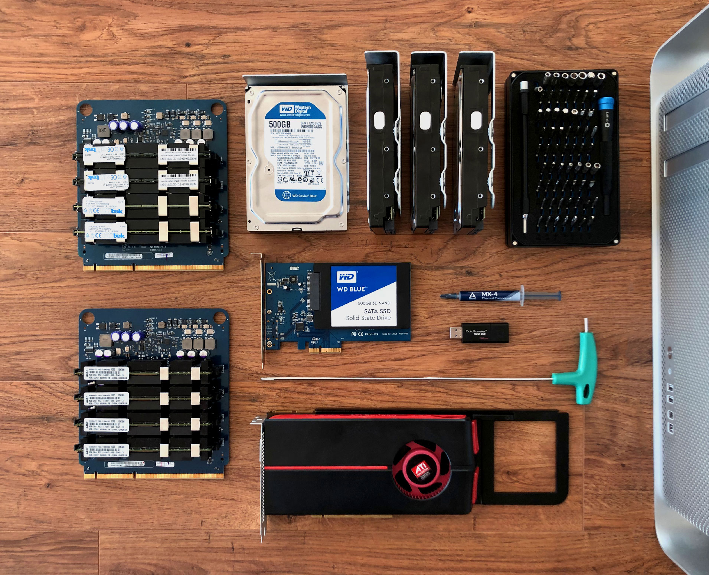

I've always liked the idea of having a home server. Conventional wisdom says not to bother, but a lot of the reasons for hosting your own server appeal to me: sharing personal files and media, having a local backup of important data, even rendering your own builds or hosting websites.

But you can do these things with other people's servers, usually far more easily or for much cheaper, so why bother hosting your own? One reason is to remain independent of the big tech companies like Google or Amazon and keep your private data truly private. Another is that by building and hosting my own server, I can learn more about them and be more self-sufficient.

    <h3>So why an old Mac Pro?</h3>
    

        They're well-suited to a lot of the tasks I'd be using a home server for. Designed for heavy use over long periods of time, server-class components; Intel Xeon processors, abundant ECC RAM, PCIE slots, and hard drive bays.
    

    

        The fact that I've always wanted one and just happened to find this 2008 model on eBay for a good price sealed the deal.
    

    

## Finding the server

When Apple announced the new Mac Pro in June 2019 I was reminded of how much I'd loved the design of the previous Mac Pro tower, long before I could ever dream of affording one. I kept thinking about them over the following months and, after reading the incredible [Definitive Mac Pro Upgrade Guide](http://blog.greggant.com/posts/2018/05/07/definitive-mac-pro-upgrade-guide.html) by Greg Gant, I decided to try and find a 2008 Mac Pro, known as the 3,1 model. 

My reasoning being that the earlier 1,1 and 2,1 models were already too obsolete, and that the newer 4,1 and 5,1 models were still too expensive owing to the fact that they were much easier to upgrade and still run current operating systems (with relatively little effort).

---

### Dredging through eBay

I made a few non-committal bids and unsurprisingly lost about three separate machines to higher bidders. It turns out I'm not an expert when it comes to eBay.

After a bit more in-depth searching, I managed to find one I really liked. It had a good configuration and looked to be pristine from the photos. Even better, it was a new posting and didn't seem to be garnering too much attention just yet. Next was seriously deciding how much I was willing to pay for it (anything more than £400 all-in would be too much on this project right now). 

So I placed my modest opening bid and checked back in each evening over the course of the week. I was made up when I eventually won the auction with a winning bid of £245. This meant I had a little bit of cash left over to spend on upgrades and tools.

> "I was incredibly grateful to the previous owner when it arrived in the original packaging without a single dent or scratch."

This machine is genuinely immaculate. Whether that speaks more to the previous owner's care or Apple's build quality, I couldn't say. All I know is that I'm thrilled to own such a well-designed piece of hardware in such good condition.

---

### Extra shopping

I then had to buy a [3mm extra-long T-Handle hex key wrench](https://www.amazon.co.uk/dp/B07D731F93/ref=psdc_1939051031_t1_B07D72Y7NL) so that I could remove the heatsinks (not a tool I imagine will see much use after this project) and replace the twelve-year-old thermal compound with fresh [thermal paste](https://www.amazon.co.uk/MX-2-Compound-Performance-Heatsink-Interface/dp/B000WU2LXC).

This Mac Pro actually came with four 500GB hard drives installed. But I want to keep all four of the Mac Pro's hard drive bays free for a RAID array, so I needed an alternative option for the boot drive.

This led to the additional purchase of an [OWC Accelsior S PCIe Adapter for 2.5" SATA III SSD Drives](https://www.amazon.co.uk/gp/product/B00WUZPMHE/ref=ppx_yo_dt_b_asin_title_o07_s00), which has the added benefit of faster read and write speeds over the SATA II ports, and a brand new [500GB Western Digital SSD](https://www.amazon.co.uk/gp/product/B073SBZ8YH/ref=ppx_yo_dt_b_asin_title_o08_s01) to boot from. This modest shopping list left me with the following specification.

- Processor - 2 x 2.8 GHz Quad-Core Intel Xeon
- Memory - 32 GB 800 MHz DDR2 FB-DIMM
- Graphics - ATI Radeon HD 5770 1024 MB
- Startup Disk - 500GB SSD (via PCIE mount)
- Storage - 1TB RAID 1+0 Array

    <h3>Life in the fast lane</h3>
    

        The 2008 Mac Pro also has dual Gigabit Ethernet ports allowing for fast transfer of data over the home network. I really only needed one port, but the second allows me to add additional network hardware further down the line.
    

    

---

## Teardown and upgrades

First thing was to test everything worked (not something you should assume with twelve-year-old hardware). After booting properly without issue, I shut the machine down again and opened up the side panel to check out the interior.

There's just one latch on the back of the case that opens up the entire side of the machine. I've been building computers for years and have yet to see a better implementation when it comes to opening up a case.

It was in as good a condition as the exterior so I gave it a good cleaning, and replaced the PRAM battery on the motherboard. These batteries maintain system settings such as date and time when the computer is powered down, and typically last about five years. Old batteries have been known to cause problems so I thought it was best not to take a chance.

Most of the components are able to be removed without tools (something I really appreciate) but the heatsinks require a long-handled hex key wrench to remove. You can see just how difficult to reach those screws are.

With the heatsinks finally removed you have access to the whole motherboard. Only the optical drive bay and power supply remain. You can really see how well thought-out the design of this machine was.

All that remained was to clean the heatsinks, apply the new thermal paste, and then put everything back where it belonged. I'm now satisfied that the hardware is properly maintained and we're ready to start focusing on software.

Next up is buying and installing the rest of the large capacity hard drives, and then migrating my media server and setting up some fun extras like a Minecraft server. In the meantime I'll keep the Mac Pro in my utility closet and monitor the temperatures in case there's a problem with airflow.

**Update:** You can now read the follow-up post [here](/home-server-part-two).
