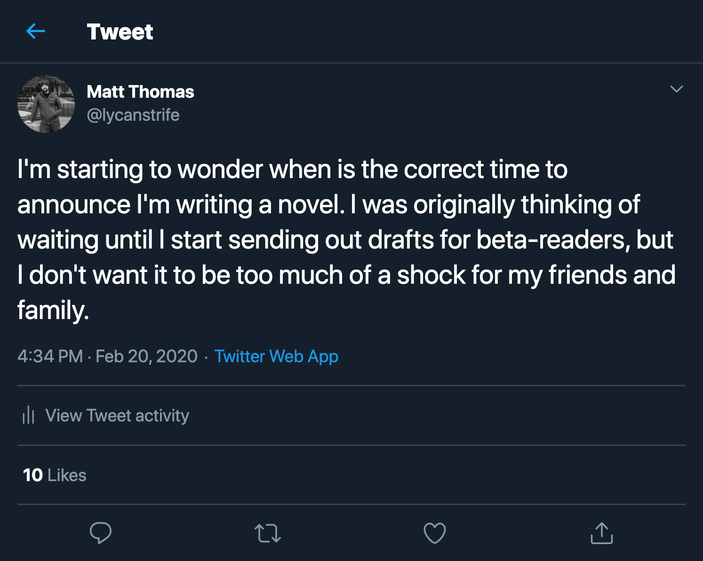
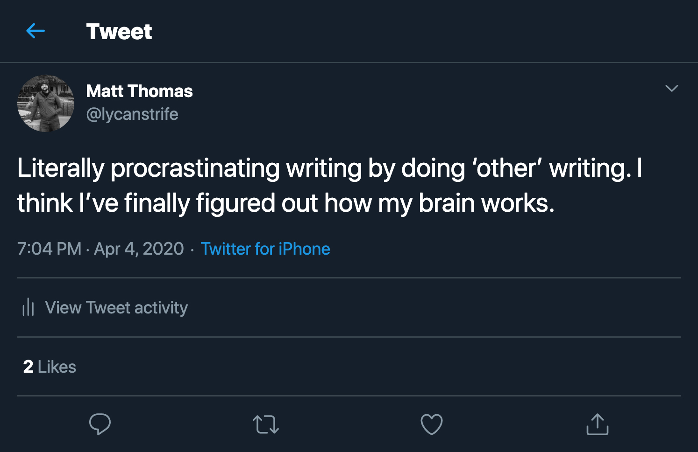
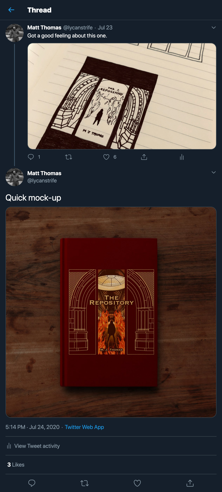

Have you ever spontaneously decided to write a novel?

I've been an avid reader all my life, but had never once considered writing a book before. The only thing I've written since leaving school has been code and the odd bit of copy for a website. But, here we are. I spontaneously decided to start writing a novel last year.

It still seems ridiculous to me, but I was turning thirty and it got me thinking about what I'd achieved so far in life (in the way only a scary milestone can do).

When it first occurred to me to try writing a novel *(in a kebab shop, at precisely 22:05 on the 2nd of October, 2019)* I realised there were several ideas I'd been thinking about already. The catalyst was actually an old saying I must have heard repeated a million times;

<blockquote class="short-quote">"There's a time and a place for everything."</blockquote>

It's an old proverb, usually interpreted as meaning **"Different things are appropriate on different occasions"**. Variations of the saying have been attributed to Benjamin Franklin and can be found as far back as the Old Testament (apparently).

I couldn't help but imagine what it would mean to take the saying literally. What if there really **was** a time and a place for everything. What would that be like, and how would it work?

"Who decides the time and place?"

"What kinds of things have a time and place?"

"Does someone make sure they're in the right place at the right time?"

"What happens if they're not?"

From there it spiralled. Finding the answers to these questions became a fun game and, more often than not, I was surprised how easily the answers became apparent. Before I knew it, I'd been working on the idea for five months and had to admit to myself that I was enjoying every minute.

I got distracted from time to time, working on this website.

Then things got truly ridiculous...

But as the scope of this ambition grew, it just resulted in me taking the writing more seriously. I started to outline properly, and plan for subplots and character arcs ahead.

Even if I did occasionally get ahead of myself...

Until I couldn't help but start thinking visually (as I always tend to do). It was inevitable that I'd try my hand at designing a book cover sooner or later.

Which leads us to this:

    

        <h3>The Repository, by M. J. Thomas</h3>
        <ul>
            <li>Word Count: Aiming for 90,000</li>
            <li>Current Word Count: 45,000</li>
            <li>ISBN: Will need one of these</li>
            <li>Genre: YA Fantasy</li>
        </ul>
    

    

Now, I'm a long long way off from my final word count, let alone published (at the time of writing, I'm about halfway through my second draft), but it felt silly that there was no mention of this undertaking anywhere on my own website. So this is it. The first real mention of my writing.

It's going to be a YA (Young Adult) Fantasy novel. I don't want to reveal too much of the actual plot just yet, but the story follows fourteen-year-old, Maddie Brooks, as she finds herself working at a library of 'fated items' called the Repository.

She meets the people in charge of making sure things are in the right place at the right time, and learns how pivotal moments throughout history have been shaped and influenced by these 'fated items'.

But why is there a cut-off past a certain date? Who's stealing items from the subfloors? And was it really a coincidence that she was offered the job in the first place? Find out... once I've tied all the different story threads together in a satisfying and meaningful way.

I'll make sure to document my progress here.
