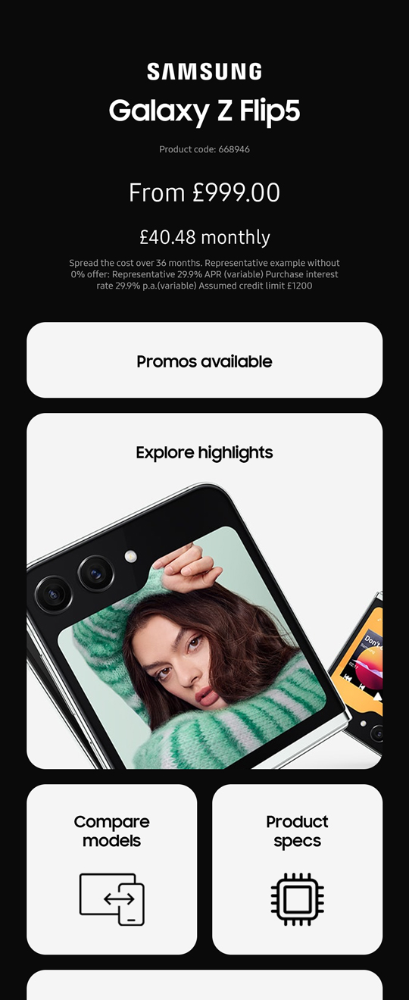

In another first for the site, I've been asked to write up a case study for a project we've been working on. I've been involved with the project from inception and we're poised to launch a substantial redesign before the end of the year.


> "Now seems an appropriate time to look back and take stock of the experience, highlighting challenges and learnings we made along the way."

<div class="book-info">
    <div class="left">
        <h3>So what is Project ARK?</h3>
        <p>
            It's an on-screen digital ticket, specifically for Samsung devices in a modern retail environment.
        </p>
        <p>
            Primarily designed to replace paper ticketing solutions but also to provide a dynamic and engaging customer experience where they can interact and learn more about the devices.
        </p>
    </div>
    
</div>

At [Volume Network](https://www.volumenetwork.com/), we have extensive experience designing, building, and managing digital screen-based projects.

We've worked alongside many of the world's most recognisable tech brands to help deliver award-winning digital experiences. These experiences help inform customers and frequently promote unique selling points in the process.

We're often tasked with producing smaller scale promotional projects to tight deadlines, but our main focus is **bespoke solutions for large scale retail environments**. Much like this one.

When we first met with Samsung, we already had a digital ticketing solution for mobile devices and smartphones. But it was fairly simple and brand-agnostic. Certainly not a bespoke solution.

We spent several hours in conversation with them, asking questions and demonstrating features, trying to ascertain their needs and how best we could help them achieve their goals.

> "Then we followed up with a quick redesign."


The initial pitch had gone smoothly, the revised design was well-received and, based on that, we were given the go ahead to kick off the project proper.

Communicating with the team at Samsung, we drew up a list of priorities and outlined the constraints. Many of the constraints were dictated by the retailers whose stores would house the fixtures. These included things such as **legally compliant fine-print** and **screen-burn avoidance measures** (to prolong the working life of the demo devices).

These things would have to be taken into account when designing.

<div class="note simple">
    <h3>The in-store Experience</h3>
    <p>
        We began exploring the stores and fixtures that were already in use and seeing how the space, both digital and physical, was being utilised.
    </p>
    
    <p>
        We found that paper tickets were having to be swapped out manually to reflect any change in pricing or seasonal promotional offers.
    </p>
    <p>
        There was also lots of information to hand. But it was spread out in several different places, displayed in several different ways, and didn't match Samsung's minimal, monochrome branding.
    </p>
    <p>
        It needed to be cohesive and remotely managed from a central location.
    </p>
</div>

> "It was decided two different digital tickets would be built."

The first would be an **on-screen ticket**, running on the demo devices already out on display. The idea was to encourage customers to focus on the devices themselves and interact directly with the hardware.

The second would be a more versatile design that could cater for any product in need of a ticket, even those without a screen of their own. It would be accessible through a cut-out in the 'furniture' on which the devices were displayed. For this reason, it was called the **furniture ticket**.

<div class="note simple">
    <h3>Designing the UI</h3>
    <p>
        Starting from our initial pitched design, we took everything we'd learned from the investigation and began to address each of the goals.
    </p>
    <p>
        To deliver an experience that truly reflected the brand, we looked directly to Samsung's own OneUI brand guidelines when working on the design.
    </p>
    
    <p>
        For the on-screen ticket in particular, keeping the promotional background video unobstructed was a key concern. You can see how much of the screen we ended up using in the screenshots below.
    </p>
</div>

Outside of the visual design and aesthetic was the core functionality.

> "Namely, how the ticket actually worked."

Much of the functionality had been built and tested before. Product information such as model name and pricing could be pulled directly from the retailer data feed. Anything not already in the feed would be managed by us. Promotions, image assets, and any calculations required for alternative financial options.

Below are some example screenshots showing how we fit all that utility into the smallest possible space. We hid optional financial information in a 'dropdown' and used modals for large promotional assets.

<div class="note screens">
    
    
    
    
    
    
</div>

The last three screenshots showcase the ability to use one screen for multiple tickets. The intended use case was for smartwatches and earbuds but it could also be used to show different capacities of a single model, as shown here.

---

### The Furniture Ticket

One of the requirements for the **on-screen ticket** was that it would stretch responsively across a huge range of Samsung devices. This included tablets in portrait and landscape mode, as well as folding phones. In comparison, the **furniture ticket** would only ever be displayed on a specific display and hidden beneath the fixture surface, where the orientation couldn't be altered.

This constraint made design and development a lot more straightforward.


There was also no need for a background video on the furniture ticket. This came with advantages, like being able to utilise the entire screen for UI. But it also came with disadvantages, like the increased risk of screen-burn.

> "Screen-burn was a big concern for an 'always-on' digital ticket." 

The most aggressive method we built to reduce screen-burn was a complete inversion of the ticket layout and colour-scheme. You can see an animated example below (the timings have been sped up for demonstration purposes).


This ensured a more balanced usage of the display across high-contrast areas. You can see we reduced the contrast further by using dark grey and light-grey instead of pure black and white (like in the screenshot below).


But that's not all. The screenshot above also demonstrates a clever use of the 'dead' space to the left and right of the screen. Because the furniture hides the edges of the device, these areas are invisible to the customer in-store.


We were able to use this space to capture useful information about the individual ticket (for when our remote support team need to check on things like the number of promos and whether or not the ticket has a chart). A remote screenshot will show all this hidden information.

---

### The Recent Redesign

So we had two ticket designs now signed off and installed in stores. But over time we noticed several opportunities to improve on the design.

On the **furniture ticket**, the navigation bar was taking up valuable vertical space on a landscape display where vertical space is lacking, and it was very text-heavy with inclusion of all the optional financial detail.


We decided to swap the bar for individual modules, with icons and imagery for each section, along with horizontal scrolling. This also solved the self-imposed constraint of having to fit everything on the screen all at the same time.

Lower priority modules could be placed 'off-screen' to the right, but were only ever a quick 'swipe' away. Another benefit was how easily they could be reordered, depending on the priorities of the retailer.

With horizontal scrolling on the main screen, there was no longer a fixed limit to the amount of information we could reasonably fit in the ticket, making it far more future-proof. Adding new modules or functionality will be easy.

<div class="note simple">
    
    <p></p>
    
    <p></p>
    
</div>

We also implemented another screen-burn avoidance measure. A very subtle **pixel-jiggle** that moves the ticket almost imperceptibly every several seconds.

These small adjustments are carefully staggered over different classes in the code. This makes the changes difficult to notice while still ensuring elements aren't in exactly the same place for too long. You can see how small the changes are in the code below.

```css
    # When cycling through classes, we can make tiny adjustments to the layout

    
    .App {
        &.one {
            #page-contents {
                .wrapper {
                    padding: 7.9vw 5.9vw;
                }

                .promo-message {
                    top: 40.9vh;

                    &.wrapped {
                        top: 22.9vh;
                    }
                }
            }
        }

        &.two {
            #page-contents {
                .wrapper {
                    padding: 8vw 6vw;
                }

                .promo-message {
                    top: 41vh;

                    &.wrapped {
                        top: 23vh;
                    }
                }
            }
        }

        &.three {
            #page-contents {
                .wrapper {
                    padding: 8.1vw 5.8vw;
                }

                .promo-message {
                    top: 41.1vh;

                    &.wrapped {
                        top: 23.1vh;
                    }
                }
            }
        }

        &.four {
            #page-contents {
                .wrapper {
                    padding: 7.8vw 5.8vw;
                }

                .promo-message {
                    top: 40.8vh;

                    &.wrapped {
                        top: 22.8vh;
                    }
                }
            }
        }
    }
```

If you look very closely at the following screenshot, you can see each of the different positions overlayed on top of one another. This makes high contrast lines and text 'fuzzier' and reduces noticeable screen-burn.

<div class="note simple">
    
</div>

By far the biggest change we made in the redesign was a fully-functioning **comparison** feature. Previous versions of the **furniture ticket** relied on static assets to compare models. These assets had to be updated with every new product launch.


