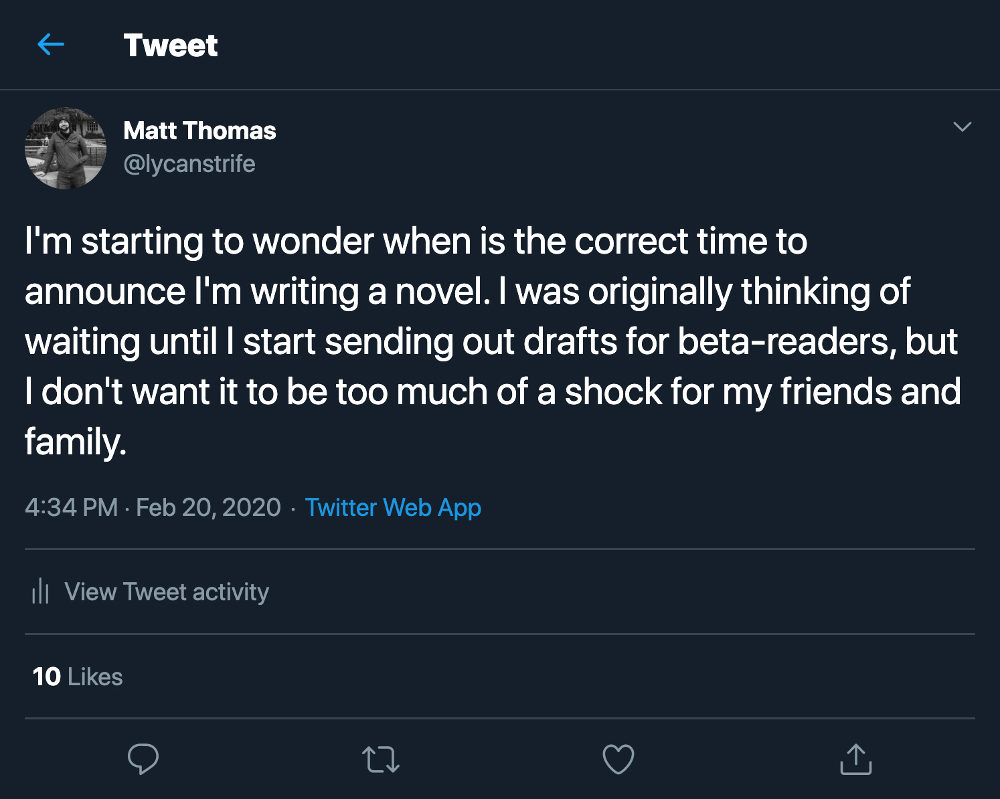
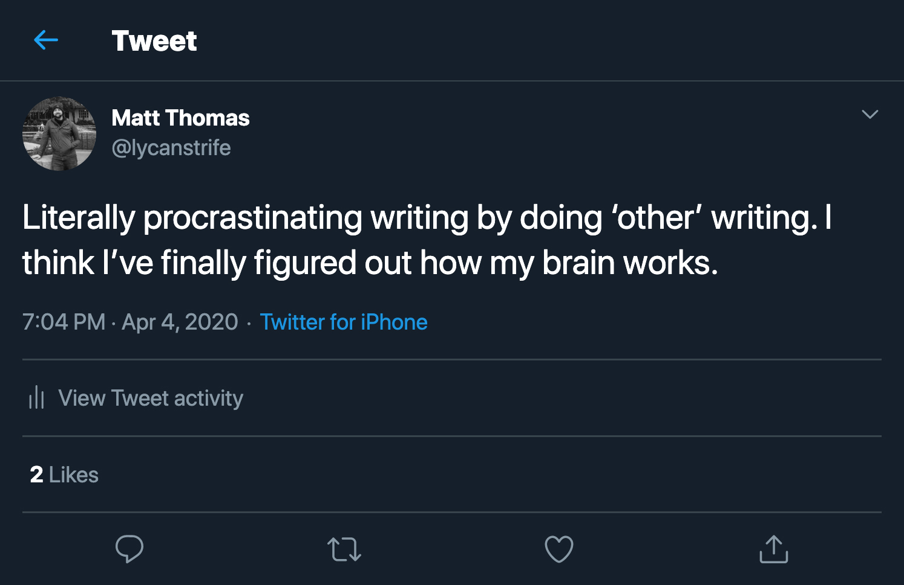
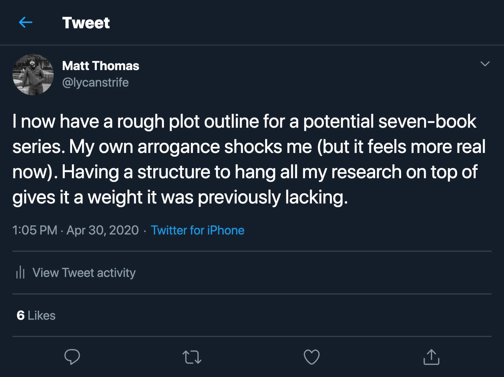
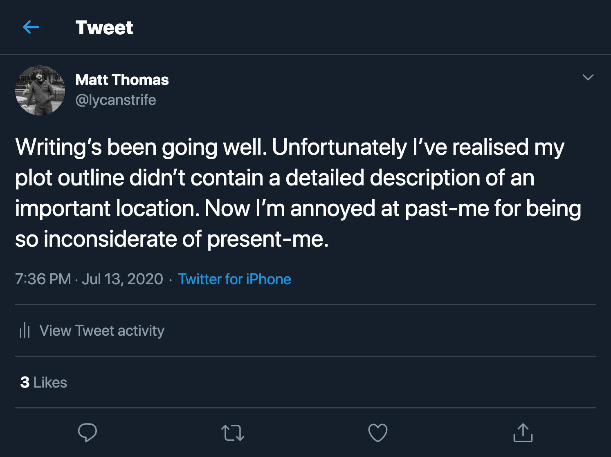
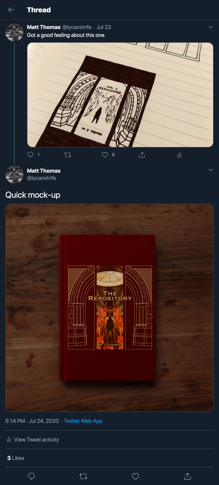

<!--- NOTE: I'm still fortunate enough to work remotely, but people are no longer being sensible re: Covid-19 --->

Have anyone ever spontaneously decided to write a novel? 

I doubt anyone would suggest 'spontaneity' as a key factor in any task that usually requires several years to complete. But here we are. I spontaneously decided to start writing a novel last year.

Even acknowledging it on here still seems faintly ridiculous, but I was turning thirty and it got me thinking about what I'd achieved so far in life (you know, in the way only a scary milestone can do).

When it first occurred to me to try writing a novel (in a kebab shop, at precisely 22:05 on the 2nd of October, 2019) I realised there were several ideas I'd been thinking about already. The catalyst was actually an old saying I must have heard repeated a million times;

<blockquote class="short-quote">"There's a time and a place for everything."</blockquote>

It's an old proverb, usually interpreted as meaning **"Different things are appropriate on different occasions"**. Variations of the saying have been attributed to Benjamin Franklin and can be found as far back as the Old Testament.

I couldn't help but imagine what it would mean to take the saying literally. Like what if there really **was** a time and a place for everything. What would that be like, and how would it work?

"Who decides the time and place?"

"What kinds of things have a time and place?"

"Does someone make sure they're in the right place at the right time?"

From there it spiralled. Finding the answers to these questions became a fun game and, more often than not, I was surprised how easily the answers became apparent. Before I knew it, I'd been working on the idea for five months and, at this point, I had to admit I was enjoying every minute.

I got distracted from time to time, working on this website.

Then things got truly ridiculous...

But this lofty ambition just resulted in me taking the writing more seriously. I started to outline properly, and plan for subplots and character arcs ahead.

Even if I did occasionally get ahead of myself...

Until I couldn't help but start thinking visually (as I always tend to do). It was inevitable that I'd try my hand at designing a book cover sooner or later.

Which leads us to this:

    

        <h3>The Repository, by M. J. Thomas</h3>
        <ul>
            <li>Word Count: Aiming for 90,000</li>
            <li>Current Word Count: 36,000</li>
            <li>ISBN: Will need one of these</li>
            <li>Genre: YA Fantasy</li>
        </ul>
    

    

Now, I'm a long long way off from being finished, let alone published (at the time of writing, I'm about a third of the way through my second draft), but it felt silly that there was no mention of this undertaking anywhere on my own website. So this is it. The first real mention of my writing.

It's going to be a YA (Young Adult) Fantasy novel. I don't want to reveal too much of the actual plot just yet, but the story follows fourteen-year-old, Maddie Brooks, as she finds herself working at a library of 'fated items' called the Repository.

She meets the people in charge of making sure things are in the right place at the right time, and learns how pivotal moments throughout history have been shaped and influenced by these 'fated items'.

But why is there a cut-off past a certain date? Who's stealing items from the subfloors? And was it really a coincidence that she was offered the job in the first place? Find out... once I've tied all the different story threads together in a satisfying and meaningful way.

I'll make sure to document my progress here.
